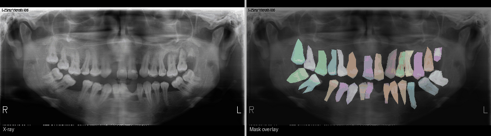

# 🦷 Dental X-ray Synthetic Generation & Segmentation

> **Authors:** Giorgio De Santis · Roberto Passante  
> **Course:** Computer Vision — University Project  
> **Stack:** Python · PyTorch · Google Colab · Pix2Pix GAN · U-Net · TransUNet

---


## 📌 Overview

This project tackles a core challenge in medical imaging: **the scarcity of annotated dental X-ray data**.  
We address it with a two-stage deep learning pipeline:

1. **Synthetic data generation** — a GAN-based approach (Pix2Pix) synthesizes realistic ortho-panoramic dental X-ray images to augment the training set.
2. **Semantic segmentation** — U-Net and TransUNet models are trained on real data and evaluated on both real and GAN-generated images, testing cross-domain generalization.

The goal is to reduce the **domain gap** between real and synthetic images, and demonstrate that synthetic data can effectively boost segmentation performance.



---

## 🗂️ Repository Structure

```
Computer-Vision-Project/
│
├── Code/
│   ├── SYNgen_final.ipynb          # Stage 1: Synthetic image generation (GAN)
│   └── Segmentation_final.ipynb    # Stage 2: Segmentation training & evaluation
│
├── Computer Vision Project Presentation.pptx
├── Dataset (link kaggle)           # Link to the Kaggle dataset
└── README.md
```

---

## 📦 Dataset

The dataset consists of ortho-panoramic dental X-ray images with corresponding **segmentation masks**, sourced from Kaggle.

> 🔗 See the `Dataset (link kaggle)` file in the root of the repo for the download link.

Below is a preview of sample images and their segmentation masks:


> *(GIF showing real X-ray images paired with their ground-truth segmentation masks)*

---

## ⚙️ Pipeline

### Stage 1 · `SYNgen_final.ipynb` — Synthetic Data Generator

**Goal:** Generate a synthetic dataset of dental X-rays to augment training data and reduce domain shift.

| Step | Description |
|------|-------------|
| 🧠 GAN training | Two independent Pix2Pix models are trained to synthesize X-ray images from different input domains |
| 🎨 Post-processing | Histogram matching and domain adaptation are applied to improve visual realism |
| 💾 Output | Generated images are saved to a shared folder (Google Drive link) for use in Stage 2 |

---

### Stage 2 · `Segmentation_final.ipynb` — Training & Evaluation

**Goal:** Train segmentation models on real data and evaluate generalization on synthetic images.

| Step | Description |
|------|-------------|
| 🏗️ Models | **U-Net** (MobileNetV2 backbone) and **TransUNet** |
| 📂 Dataset modes | `real` · `synt` · `mix` (real + synthetic) |
| 🏋️ Training | AdamW optimizer · learning rate scheduler · AMP (mixed precision) |
| 📊 Evaluation | mIoU · Dice coefficient · per-class scores |
| 💾 Output | Prediction images + metrics report saved as `.txt` |

---

## 🚀 Quickstart

### Option A — Full Pipeline (recommended)

```bash
# Step 1 — Run Stage 1 in Google Colab
# Open SYNgen_final.ipynb → Run all cells
# → A Google Drive link to the synthetic images folder is generated

# Step 2 — Paste the link into Stage 2
# Open Segmentation_final.ipynb → Update the SYN_FOLDER variable

# Step 3 — Run Stage 2
# Choose DATA_MODE: real | synt | mix
# → Train, evaluate, and compare results across domains
```

### Option B — Segmentation Only

```bash
# Make sure the synthetic Drive folder link has not expired
# Open Segmentation_final.ipynb → Run all cells
```

---

## 🎛️ Configurable Parameters

Both notebooks expose a `# Globals` section at the top for easy configuration:

| Parameter | Description |
|-----------|-------------|
| `IMG_SIZE` | Input image resolution |
| `LAMBDA_L1` | Weight of L1 loss in GAN training |
| `LAMBDA_PERC` | Weight of perceptual loss |
| `DATA_MODE` | Training data source: `real`, `synt`, or `mix` |
| `DATA_MODE_VAL` | Validation data source |
| `SYN_RATIO` | Proportion of synthetic samples in mixed mode |
| `MIX_STRATEGY` | Strategy for mixing real/synthetic training data |
| `MIX_STRATEGY_VAL` | Strategy for mixing real/synthetic validation data |
| `batch_size` | Batch size for training |
| `epochs` | Number of training epochs |
| `LR` | Learning rate |

---

## 📈 Results

Models are evaluated on real and synthetic test sets using:

- **mIoU** (mean Intersection over Union)
- **Dice Coefficient**
- **Per-class scores**

Detailed results and metrics are saved in the output `.txt` file generated at the end of `Segmentation_final.ipynb`.

---

## 🛠️ Requirements

The notebooks are designed to run on **Google Colab** (GPU recommended).  
Main dependencies: `PyTorch`, `torchvision`, `numpy`, `PIL`, `matplotlib`, `tqdm`.

---

## 📄 License

This project was developed for academic purposes. See individual notebook headers for references to third-party code and models used.

---
